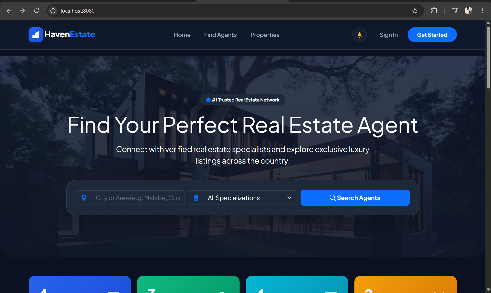
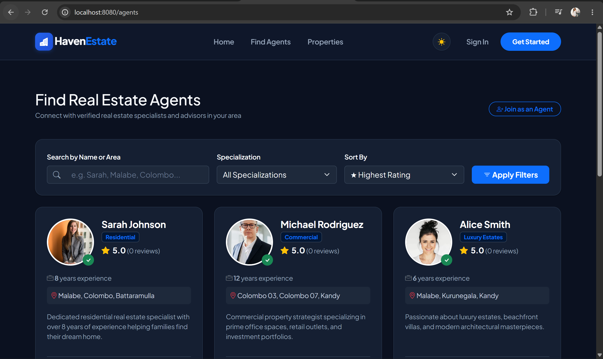
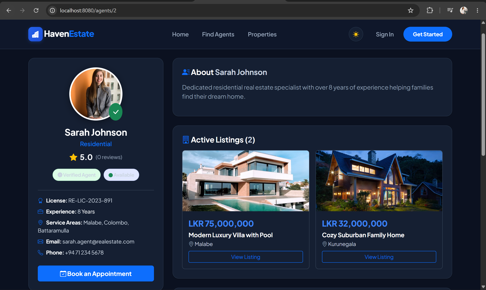
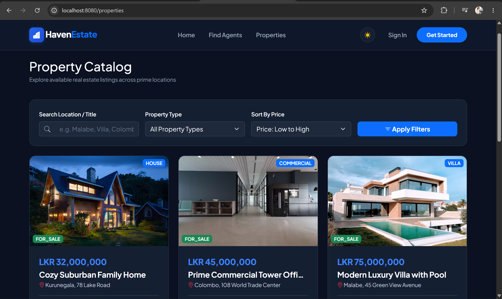
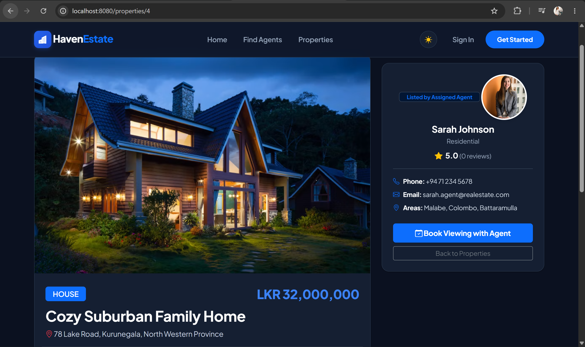
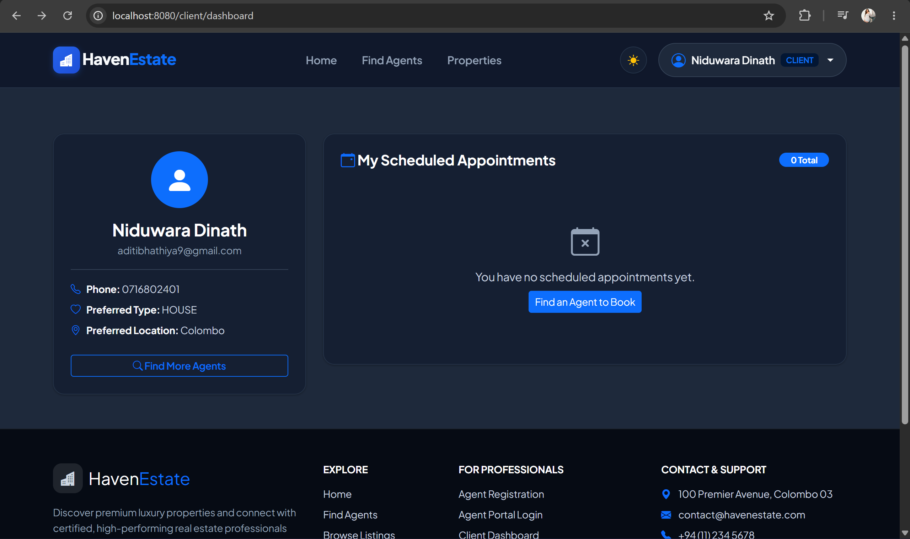
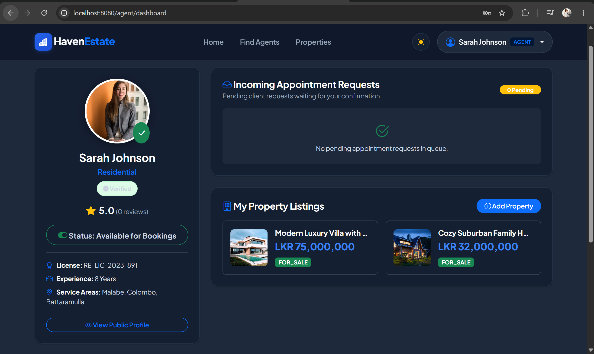
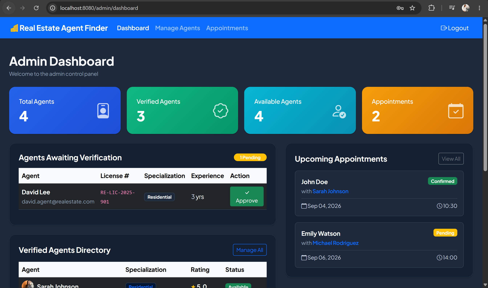

# Real Estate Agent Finder & Appointment Management System

[](https://openjdk.org/)
[](https://spring.io/projects/spring-boot)
[](https://hibernate.org/)
[](https://www.h2database.com/)
[](https://www.thymeleaf.org/)
[](https://getbootstrap.com/)

A modern, full-stack enterprise web platform connecting property seekers with verified real estate agents. Engineered with **Spring Boot 3**, **Spring Data JPA**, **BCrypt Security**, and a **Custom Data Structures & Algorithms (DSA) Engine**.

---

## 📸 Screenshots & UI Showcase

<p align="center">
  
</p>

<details open>
<summary><b>🖼️ Click to expand full platform walkthrough & views</b></summary>
<br>

| 1. Find & Filter Agents | 2. Agent Profile & Booking Modal |
| :---: | :---: |
|  |  |

| 3. Property Catalog (Bubble Sort) | 4. Property Details & Specs |
| :---: | :---: |
|  |  |

| 5. Client Appointments Dashboard | 6. Agent Request Queue Portal |
| :---: | :---: |
|  |  |

| 7. Admin Control Center | 8. Dark Mode Luxury Aesthetic |
| :---: | :---: |
|  |  |

</details>

---

## 🌟 Key Features

### 1. 🛡️ Role-Based Access Control (RBAC) & Security
- **3 User Roles**: `CLIENT`, `AGENT`, and `ADMIN`.
- Secure authentication with **BCrypt** password hashing and session management.
- Quick demo 1-click credential buttons for effortless evaluation.

### 2. 🔍 Real Estate Agent Finder & Smart Search
- Multi-attribute search by name, city, location, and specialization (*Residential, Commercial, Luxury, Industrial, Rental*).
- Filter by minimum rating and years of experience.
- Verification badges for approved agents and live availability status toggles.

### 3. 🏡 Property Listings Management
- High-resolution property showcase with prices, specs (*bedrooms, bathrooms, sq. ft*), location, and assigned agent.
- Price sorting engine (*Low-to-High* and *High-to-Low*).
- Agents can publish, update, and manage property listings directly from their portal.

### 4. 📅 Interactive Appointment Scheduling & Booking Engine
- Clients can book viewings and consultations with specific agents for chosen dates and times.
- Status workflow: `PENDING` $\rightarrow$ `CONFIRMED` $\rightarrow$ `COMPLETED` / `CANCELLED`.
- Agent queue management to accept or decline incoming client booking requests.

### 5. ⭐ Agent Reviews & Feedback System
- Verified client reviews with 1 to 5 star ratings and detailed comments.
- Dynamic recalculation of aggregate agent rating and review counts on submission.

### 6. 📊 Executive Admin Control Center
- Live platform statistics cards (*Total Agents, Verified Agents, Active Properties, Total Appointments*).
- Agent verification queue with single-click approve and revoke controls.
- System-wide appointment oversight.

---

## 🧠 Data Structures & Algorithms (DSA) Engine

This project incorporates custom classical algorithms and data structures implemented in `com.dilshan.realestate.dsa`:

| Component | Data Structure / Algorithm | Purpose | Time Complexity | Space Complexity |
| :--- | :--- | :--- | :--- | :--- |
| **Agent Indexing** | **Binary Search Tree (BST)** (`AgentBST`) | Node-based tree indexing for fast rating/ID lookup & in-order traversal | $O(\log n)$ avg search/insert | $O(n)$ |
| **Agent Ranking** | **Selection Sort** (`SortEngine`) | Sorts agents by customer rating in descending order | $O(n^2)$ | $O(1)$ in-place |
| **Property Filter** | **Bubble Sort** (`SortEngine`) | In-place sorting of properties by price with early-exit optimization | $O(n)$ best, $O(n^2)$ worst | $O(1)$ in-place |
| **Experience Rank**| **QuickSort** (`SortEngine`) | Divide-and-conquer sorting of agents by years of experience | $O(n \log n)$ avg | $O(\log n)$ |
| **Appointment Line**| **FIFO Linked Queue** (`AppointmentQueue`) | First-In-First-Out queue for incoming pending appointment requests | $O(1)$ enqueue/dequeue | $O(n)$ |

---

## 🏗️ System Architecture

```
com.dilshan.realestate
├── RealEstateApplication.java         # Application Entry Point
├── config/
│   └── DataInitializer.java           # Automated Realistic Sample Data Seeder
├── dsa/                               # Algorithmic & Data Structure Layer
│   ├── AgentBST.java                  # Binary Search Tree (Agent Index)
│   ├── SortEngine.java                # Selection Sort, Bubble Sort, QuickSort
│   └── AppointmentQueue.java          # FIFO Linked Queue (Appointments)
├── model/                             # Domain Entities (JPA / OOP Inheritance)
│   ├── User.java                      # Abstract Base User (Joined Inheritance)
│   ├── Agent.java                     # Professional Agent Entity
│   ├── Client.java                    # Customer / Client Entity
│   ├── Admin.java                     # System Admin Entity
│   ├── Property.java                  # Real Estate Listing Entity
│   ├── Appointment.java               # Booking Entity
│   ├── Feedback.java                  # Review & Rating Entity
│   └── enums/                         # System Enums (Role, Specialization, etc.)
├── repository/                        # Spring Data JPA Data Access Layer
├── service/                           # Business Logic & Service Orchestration
└── controller/                        # Spring MVC Web Controllers
```

---

## 🚀 Quick Start & How to Run

### Prerequisites
- **Java JDK 21+** installed
- **Maven** (included via wrapper `mvnw.cmd` / `./mvnw`)

### 1. Clone & Navigate to Project
```bash
git clone https://github.com/niduwara-j/Real-Estate-and-Agent-Finder.git
cd Real-Estate-and-Agent-Finder
```

### 2. Run the Application
You can run it directly using the Maven wrapper:

**On Windows (PowerShell / Command Prompt):**
```powershell
.\mvnw.cmd spring-boot:run
```

**On macOS / Linux:**
```bash
./mvnw spring-boot:run
```

**Or in IntelliJ IDEA:**
Open the project and run `RealEstateApplication.java` (Green Play ▶ button).

### 3. Open in Browser
Navigate to:
```
http://localhost:8080/
```

### 4. Embedded Database Console
H2 web console is available at:
```
http://localhost:8080/h2-console
JDBC URL: jdbc:h2:file:./data/realestate_db
Username: sa
Password: password
```

---

## 🔑 Pre-Seeded Demo Accounts

The application automatically seeds realistic agents, properties, appointments, and reviews upon first launch:

| Role | Email | Password | Features / Dashboard |
| :--- | :--- | :--- | :--- |
| **System Admin** | `admin@realestate.com` | `admin123` | Verification Queue, Metrics, Appointment Moderation |
| **Verified Agent** | `sarah.agent@realestate.com` | `agent123` | Availability Toggle, Request Queue, Property Manager |
| **Client** | `client@realestate.com` | `client123` | Book Appointments, View Schedule, Leave Reviews |

*(You can also use the 1-click Demo buttons on the `/login` page)*

---

## 🧪 Running Automated Tests

Run the full JUnit 5 test suite verifying DSA structures, services, and Spring Boot context:
```powershell
.\mvnw.cmd test
```

---

## 📄 License
This project is licensed under the MIT License.
